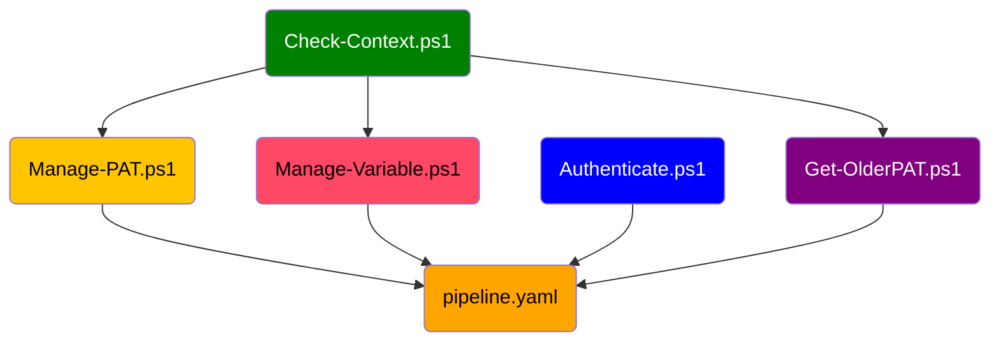

# General
Install:
- Powershell 7
- WSL ubuntu
- Neovim (Make a symbolic link in ~/.local/bin which points to the actual location of neovim. For example nvim -> ./squashfs-root/usr/bin/nvim)
- Vscode
- Azure CLI and Azure PowerShell
- Docker Desktop

The dendency graph of the files in this directory is shown below:

